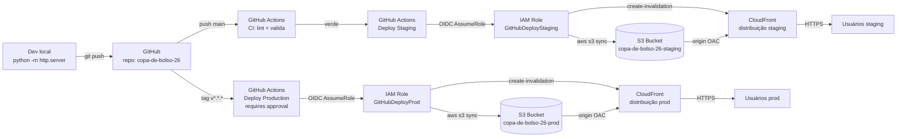
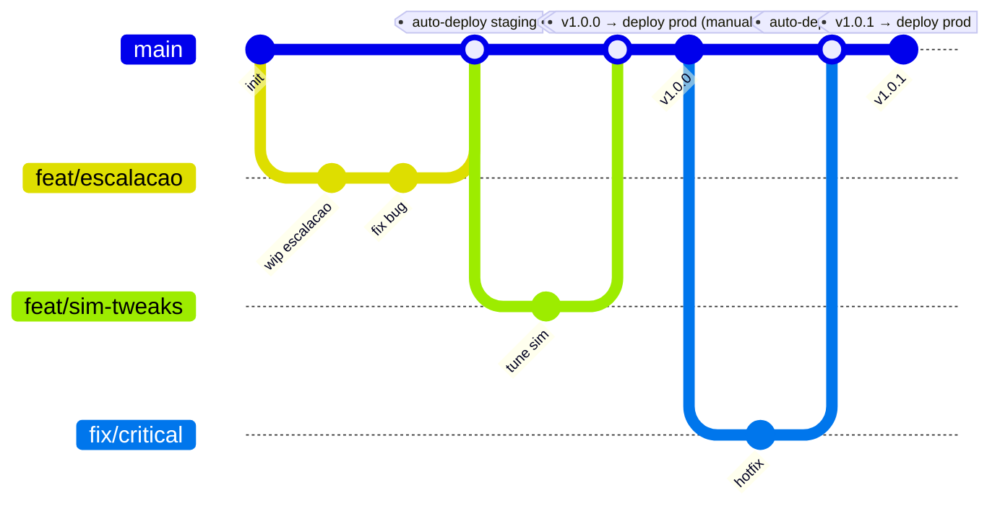
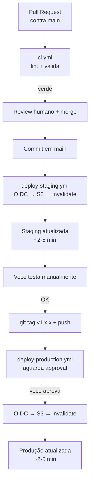

# SDLC do código à produção — Copa de Bolso '26

Esteira de entrega contínua para o jogo **Copa de Bolso '26** (SPA estática vanilla JS) usando GitHub + GitHub Actions + AWS (S3 + CloudFront), com ambientes separados de **homologação (staging)** e **produção**.

Este documento é prescritivo: ele assume escolhas, justifica em uma linha e te leva do repositório vazio à produção rodando. Siga na ordem.

---

## 1. Visão geral da arquitetura



A bifurcação é por **gatilho do GitHub**, não por branch separada: `push` em `main` vai pra staging, **tag** semântica vai pra prod. Detalhado na seção 4.

---

## 2. Arquitetura AWS proposta

### O que vamos usar

| Serviço | Para quê | Por quê |
|---|---|---|
| **S3** (2 buckets) | Hospedar HTML/CSS/JS estáticos | Storage barato, durabilidade 11 noves, integra nativo com CloudFront |
| **CloudFront** (2 distribuições) | CDN + HTTPS + cache | Latência global baixa, certificado grátis via ACM, headers configuráveis |
| **ACM** | Certificados TLS | Grátis e gerenciado; renovação automática |
| **IAM + OIDC** | GitHub Actions autenticar na AWS | **Zero AWS keys** no GitHub; tokens efêmeros assumidos por workflow |
| **Route 53** (opcional, 3.9) | DNS customizado | Só se você for plugar `copa.exemplo.com` — caminho principal usa URL default do CloudFront |
| **CloudWatch** | Métricas básicas (4xx/5xx, requests) | Grátis pras métricas padrão; alarme opcional |

### Por quê essa stack

- **Sem servidor pra manter.** Bucket + CDN não tem patch, escalonamento ou capacity planning.
- **Custo previsível e baixo.** Demo de baixo tráfego cabe em <$3/mês (detalhado na seção 10).
- **Alta disponibilidade fora da caixa.** S3 (11 noves) + CloudFront (edges globais) já entregam SLA melhor que qualquer setup VM/container caseiro.
- **OIDC elimina segredos de longa duração.** É o padrão recomendado pela AWS e pela GitHub desde 2022 ([docs AWS](https://docs.aws.amazon.com/IAM/latest/UserGuide/id_roles_providers_create_oidc.html), [docs GitHub](https://docs.github.com/en/actions/deployment/security-hardening-your-deployments/about-security-hardening-with-openid-connect)).

### Convenções de nomes

Tudo derivado de `copa-de-bolso-26`:

```
Buckets:        copa-de-bolso-26-staging         copa-de-bolso-26-prod
Distribuições:  E-STAGING-ID                    E-PROD-ID
IAM Roles:      GitHubDeployCopaStaging         GitHubDeployCopaProd
GH Environments: staging                        production
```

Região padrão: **us-east-1** (CloudFront e ACM exigem certificados em us-east-1; manter tudo lá simplifica).

---

## 3. Setup inicial passo a passo

> **Pré-requisitos:** conta AWS ativa, AWS CLI v2 instalado (`aws --version` >= 2.x), conta GitHub, Git instalado, permissões de admin na conta AWS para o setup inicial (depois você restringe).

### 3.1 Criar repositório no GitHub

Sugestão: **privado**. Demo solo não precisa exposição pública, e privado evita scan de secrets vazados. Pra tornar público depois: **Settings → General → Danger Zone → Change visibility**.

No GitHub web:
1. **New repository** → nome `copa-de-bolso-26` → visibilidade **Private** → **não** inicialize com README/`.gitignore`/license (já temos arquivos locais).
2. Anote a URL: `git@github.com:SEU_USER/copa-de-bolso-26.git`.

### 3.2 Inicializar repo local e primeiro push

Na raiz `C:\Users\pedro\Claude\copa-de-bolso-26\`:

```bash
git init -b main
```

Crie `.gitignore` na raiz:

```gitignore
# Python (do server local)
__pycache__/
*.pyc

# macOS / Windows
.DS_Store
Thumbs.db

# Editores
.vscode/
.idea/
*.swp

# Logs / temp
*.log
.cache/
.tmp/

# Node (caso adicione tooling futuro)
node_modules/
npm-debug.log*
```

Configure remote e faça o primeiro push:

```bash
git add .
git commit -m "chore: bootstrap repo"
git remote add origin git@github.com:SEU_USER/copa-de-bolso-26.git
git push -u origin main
```

### 3.3 Criar 2 buckets S3

> **Por quê 2 buckets:** isolamento total entre ambientes. Bug em staging não toca prod. Permissão de role staging só enxerga bucket staging.

Substitua `SEU-PREFIXO` por algo único globalmente (ex: suas iniciais + número). Buckets S3 têm namespace global.

```bash
# Staging
aws s3api create-bucket \
  --bucket SEU-PREFIXO-copa-de-bolso-26-staging \
  --region us-east-1

aws s3api put-bucket-versioning \
  --bucket SEU-PREFIXO-copa-de-bolso-26-staging \
  --versioning-configuration Status=Enabled

aws s3api put-public-access-block \
  --bucket SEU-PREFIXO-copa-de-bolso-26-staging \
  --public-access-block-configuration "BlockPublicAcls=true,IgnorePublicAcls=true,BlockPublicPolicy=true,RestrictPublicAccess=true"

# Produção (repita com sufixo -prod)
aws s3api create-bucket \
  --bucket SEU-PREFIXO-copa-de-bolso-26-prod \
  --region us-east-1

aws s3api put-bucket-versioning \
  --bucket SEU-PREFIXO-copa-de-bolso-26-prod \
  --versioning-configuration Status=Enabled

aws s3api put-public-access-block \
  --bucket SEU-PREFIXO-copa-de-bolso-26-prod \
  --public-access-block-configuration "BlockPublicAcls=true,IgnorePublicAcls=true,BlockPublicPolicy=true,RestrictPublicAccess=true"
```

> **Por quê versioning ligado:** habilita rollback instantâneo (seção 8) — pode restaurar versão anterior de qualquer objeto sem precisar reverter código.
>
> **Por quê bloqueio público total:** acesso será exclusivo via CloudFront (Origin Access Control). Bucket nunca atende usuário diretamente — elimina vazamento por bucket aberto.

### 3.4 Criar 2 distribuições CloudFront com OAC

OAC (Origin Access Control) é o substituto do antigo OAI, lançado em 2022 e é o que a AWS recomenda hoje ([docs](https://docs.aws.amazon.com/AmazonCloudFront/latest/DeveloperGuide/private-content-restricting-access-to-s3.html)).

**Via Console** (mais simples que CLI pra distribuição completa, porque tem ~30 campos):

1. **CloudFront → Create distribution**
2. **Origin domain**: selecionar `SEU-PREFIXO-copa-de-bolso-26-staging.s3.us-east-1.amazonaws.com`
3. **Origin access** → **Origin access control settings (recommended)** → **Create new OAC** → nome `oac-copa-staging`, signing behavior **Sign requests**
4. **Default root object**: `index.html`
5. **Viewer protocol policy**: **Redirect HTTP to HTTPS**
6. **Allowed HTTP methods**: GET, HEAD
7. **Cache policy**: **CachingOptimized** (managed)
8. **Response headers policy**: **CORS-with-preflight-and-SecurityHeadersPolicy** (managed) — isso te dá HSTS, X-Content-Type-Options, X-Frame-Options, Referrer-Policy de graça, sem Lambda@Edge. CSP estrito fica no roadmap.
9. **WAF**: Do not enable (pode ligar depois)
10. **Price class**: **Use only North America and Europe** (mais barato; pra demo basta)
11. **Custom SSL certificate**: deixa em branco por enquanto (default `*.cloudfront.net` cobre)
12. **Default root object**: `index.html` (reconfirmar)
13. **Create distribution**

Após criar, o console mostra um banner com a **bucket policy** que precisa ser aplicada ao S3 pra OAC funcionar. **Copy policy** → cole na aba **Permissions → Bucket policy** do bucket S3.

A policy gerada terá esse formato:

```json
{
  "Version": "2012-10-17",
  "Statement": [{
    "Sid": "AllowCloudFrontServicePrincipal",
    "Effect": "Allow",
    "Principal": { "Service": "cloudfront.amazonaws.com" },
    "Action": "s3:GetObject",
    "Resource": "arn:aws:s3:::SEU-PREFIXO-copa-de-bolso-26-staging/*",
    "Condition": {
      "StringEquals": {
        "AWS:SourceArn": "arn:aws:cloudfront::SEU_ACCOUNT_ID:distribution/E-STAGING-ID"
      }
    }
  }]
}
```

**Crie um Custom Error Response** pra SPA não dar 403/404 em rota direta (mesmo sendo SPA single-page, evita 403 no asset em flight):
- CloudFront → distribuição → **Error pages → Create custom error response**
- HTTP error code **403** → Customize error response **Yes** → Response page path `/index.html` → HTTP response code **200**
- Repetir pra **404**.

**Repita 1–13 pra produção** com nomes `*-prod` e bucket prod.

Anote os dois IDs de distribuição (`E-STAGING-ID`, `E-PROD-ID`) e os dois domínios (`d111.cloudfront.net`, `d222.cloudfront.net`) — vai precisar nos workflows.

### 3.5 Criar OIDC Provider na AWS

Uma vez por conta AWS, serve pra qualquer repo GitHub:

```bash
aws iam create-open-id-connect-provider \
  --url https://token.actions.githubusercontent.com \
  --client-id-list sts.amazonaws.com \
  --thumbprint-list 6938fd4d98bab03faadb97b34396831e3780aea1
```

> O thumbprint acima é o atual da Actions OIDC. A AWS hoje valida automaticamente certs do `token.actions.githubusercontent.com`, mas o campo é obrigatório no create. Confira na [doc](https://docs.github.com/en/actions/deployment/security-hardening-your-deployments/configuring-openid-connect-in-amazon-web-services) se mudou.

### 3.6 Criar 2 IAM Roles com trust policy restritivo

**Trust policy** — define **quem pode assumir a role**. Aqui restringimos por:
- Repo específico (`SEU_USER/copa-de-bolso-26`)
- Environment GitHub específico (`staging` ou `production`)

Salve como `trust-staging.json`:

```json
{
  "Version": "2012-10-17",
  "Statement": [{
    "Effect": "Allow",
    "Principal": {
      "Federated": "arn:aws:iam::SEU_ACCOUNT_ID:oidc-provider/token.actions.githubusercontent.com"
    },
    "Action": "sts:AssumeRoleWithWebIdentity",
    "Condition": {
      "StringEquals": {
        "token.actions.githubusercontent.com:aud": "sts.amazonaws.com",
        "token.actions.githubusercontent.com:sub": "repo:SEU_USER/copa-de-bolso-26:environment:staging"
      }
    }
  }]
}
```

E `trust-prod.json` (mesma estrutura, `:environment:production` no `sub`).

Crie as roles:

```bash
aws iam create-role \
  --role-name GitHubDeployCopaStaging \
  --assume-role-policy-document file://trust-staging.json

aws iam create-role \
  --role-name GitHubDeployCopaProd \
  --assume-role-policy-document file://trust-prod.json
```

**Policy de permissões** (least-privilege) — salve como `deploy-policy-staging.json`:

```json
{
  "Version": "2012-10-17",
  "Statement": [
    {
      "Sid": "S3DeployStaging",
      "Effect": "Allow",
      "Action": [
        "s3:PutObject",
        "s3:DeleteObject",
        "s3:GetObject",
        "s3:ListBucket"
      ],
      "Resource": [
        "arn:aws:s3:::SEU-PREFIXO-copa-de-bolso-26-staging",
        "arn:aws:s3:::SEU-PREFIXO-copa-de-bolso-26-staging/*"
      ]
    },
    {
      "Sid": "CloudFrontInvalidateStaging",
      "Effect": "Allow",
      "Action": "cloudfront:CreateInvalidation",
      "Resource": "arn:aws:cloudfront::SEU_ACCOUNT_ID:distribution/E-STAGING-ID"
    }
  ]
}
```

Anexe (com a versão prod equivalente apontando pro bucket/distribuição prod):

```bash
aws iam put-role-policy \
  --role-name GitHubDeployCopaStaging \
  --policy-name DeployCopaStaging \
  --policy-document file://deploy-policy-staging.json

aws iam put-role-policy \
  --role-name GitHubDeployCopaProd \
  --policy-name DeployCopaProd \
  --policy-document file://deploy-policy-prod.json
```

Anote os ARNs:

```bash
aws iam get-role --role-name GitHubDeployCopaStaging --query 'Role.Arn' --output text
aws iam get-role --role-name GitHubDeployCopaProd --query 'Role.Arn' --output text
```

### 3.7 Criar 2 GitHub Environments

No GitHub: **Settings → Environments → New environment**.

1. **`staging`** — sem aprovador. Adicione:
   - **Environment variables** → `AWS_ROLE_ARN` = `arn:aws:iam::SEU_ACCOUNT_ID:role/GitHubDeployCopaStaging`
   - `S3_BUCKET` = `SEU-PREFIXO-copa-de-bolso-26-staging`
   - `CLOUDFRONT_DISTRIBUTION_ID` = `E-STAGING-ID`

2. **`production`** — adicione **Required reviewers** = você mesmo. Variables:
   - `AWS_ROLE_ARN` = `arn:aws:iam::SEU_ACCOUNT_ID:role/GitHubDeployCopaProd`
   - `S3_BUCKET` = `SEU-PREFIXO-copa-de-bolso-26-prod`
   - `CLOUDFRONT_DISTRIBUTION_ID` = `E-PROD-ID`

> Use **variables** (não secrets) pra ARN/bucket/dist ID — não são segredo (não permitem nada sem trust policy correspondente), e variables aparecem em logs facilitando debug.

### 3.8 Branch protection + required reviewers

**Settings → Branches → Add branch ruleset → Target `main`:**

- **Restrict deletions**: on
- **Require a pull request before merging**: on
  - **Required approvals**: 1 (você mesmo, pra forçar o ritual de PR)
  - **Dismiss stale approvals**: on
- **Require status checks to pass**: on → adicione o job `ci` (vai aparecer depois do primeiro run)
- **Block force pushes**: on

Pra **tags** `v*.*.*`: ruleset adicional **Target tags** com pattern `v*.*.*` → **Restrict deletions**: on. Isso evita apagar tag de release acidentalmente.

### 3.9 (Opcional) Domínio customizado via Route 53 + ACM

Pule essa seção se for usar só URL default do CloudFront (`d111.cloudfront.net`). Volte aqui quando comprar domínio.

**Pré-requisito:** domínio já registrado (Route 53, Registro.br, Cloudflare Registrar, etc.).

1. **Route 53 → Hosted zones → Create hosted zone** com seu domínio (ex: `copadebolso.com.br`). Se registrou no Route 53, já vem criado.
2. **ACM → Request certificate** **em us-east-1** (CloudFront exige). Domain names: `copa.copadebolso.com.br` (staging) e `copadebolso.com.br` + `www.copadebolso.com.br` (prod). Validation method: **DNS validation**.
3. ACM mostra registros CNAME pra criar; clique **Create records in Route 53** — valida sozinho em alguns minutos.
4. **CloudFront → distribuição → Edit**: adicione **Alternate domain name (CNAME)** com os hostnames acima e selecione o cert ACM correspondente.
5. **Route 53**: crie um **A record → Alias to CloudFront distribution** pra cada hostname, apontando pra distribuição correspondente.

Pronto. `https://copadebolso.com.br` chega no CloudFront prod.

---

## 4. Estratégia de branching e ambientes

### Recomendação: trunk-based

- **`main`** é o tronco. Todo trabalho vira PR → review → merge em `main`.
- Cada merge em `main` dispara **deploy automático em staging**.
- Quando staging está aprovado manualmente (você testa), você cria uma **tag SemVer** (`v1.2.0`) em cima do commit que quer promover.
- A tag dispara **deploy em produção**, que ainda exige **aprovação no GitHub Environment**.

### Por quê trunk-based pra esse projeto

- Solo developer + demo pequeno = overhead de GitFlow (branches `develop`, `release/*`, `hotfix/*`) não compensa.
- Releases viram um ato deliberado (tag), não um efeito colateral de merge.
- Rollback é simples: tag aponta pra commit; pra reverter, basta nova tag em commit anterior.

### Alternativa: GitFlow

Se o time crescer pra 3+ devs com features paralelas longas, considere GitFlow: branch `develop` deploya staging, merge `develop → main` deploya prod, branches `release/*` pra estabilização e `hotfix/*` saindo de `main`. Adiciona cerimônia mas isola release stabilization de feature work em paralelo. Por ora, **mantenha trunk-based**.

### Diagrama do flow



### Pipeline de deploy (visão por etapa)



---

## 5. GitHub Actions workflows

Crie a pasta `.github/workflows/` no repo. Três arquivos:

### 5.1 `.github/workflows/ci.yml`

Roda em todo push e PR. Valida sintaxe JS, lint HTML, lint CSS. Não deploya nada.

```yaml
name: CI

on:
  push:
    branches: [main]
  pull_request:
    branches: [main]

jobs:
  ci:
    name: Lint & validate
    runs-on: ubuntu-latest
    steps:
      - name: Checkout
        uses: actions/checkout@v4

      - name: Setup Node
        uses: actions/setup-node@v4
        with:
          node-version: '20'

      - name: Install validators
        run: |
          npm install --no-save \
            htmlhint@1.1.4 \
            stylelint@16.2.1 \
            stylelint-config-standard@36.0.0

      - name: Validate JS syntax (node --check em cada .js)
        run: |
          find assets/js -name '*.js' -print0 | xargs -0 -n1 node --check

      - name: Lint HTML
        run: npx htmlhint "index.html"

      - name: Lint CSS
        run: |
          echo '{"extends":"stylelint-config-standard","rules":{"no-descending-specificity":null}}' > .stylelintrc.json
          npx stylelint "assets/css/**/*.css"

      - name: Verificar imports ES quebrados (smoke)
        run: |
          # Confere se cada `import ... from '...'` aponta pra arquivo existente
          node -e "
          const fs = require('fs');
          const path = require('path');
          const glob = (dir) => fs.readdirSync(dir, {withFileTypes:true}).flatMap(d => {
            const p = path.join(dir, d.name);
            return d.isDirectory() ? glob(p) : [p];
          }).filter(f => f.endsWith('.js'));
          const files = glob('assets/js');
          let failed = false;
          for (const f of files) {
            const src = fs.readFileSync(f, 'utf8');
            const re = /from\s+['\"]([^'\"]+)['\"]/g;
            let m;
            while ((m = re.exec(src))) {
              const target = path.resolve(path.dirname(f), m[1]);
              if (!fs.existsSync(target) && !fs.existsSync(target + '.js')) {
                console.error('Import quebrado em ' + f + ': ' + m[1]);
                failed = true;
              }
            }
          }
          process.exit(failed ? 1 : 0);
          "
```

> **Por quê não usar build:** projeto é vanilla ES modules. `node --check` valida sintaxe de cada arquivo isoladamente, e o smoke script confere que `import './foo.js'` aponta pra arquivo real. Suficiente sem TS/bundler.

### 5.2 `.github/workflows/deploy-staging.yml`

```yaml
name: Deploy → Staging

on:
  push:
    branches: [main]

# Necessário pra OIDC
permissions:
  id-token: write
  contents: read

# Cancela deploy anterior se chegou um novo commit em main
concurrency:
  group: deploy-staging
  cancel-in-progress: true

jobs:
  deploy:
    name: Deploy staging
    runs-on: ubuntu-latest
    environment: staging
    steps:
      - name: Checkout
        uses: actions/checkout@v4

      - name: Configure AWS credentials (OIDC)
        uses: aws-actions/configure-aws-credentials@v4
        with:
          role-to-assume: ${{ vars.AWS_ROLE_ARN }}
          aws-region: us-east-1
          role-session-name: gh-actions-deploy-staging

      - name: Sync assets to S3 (cacheable, hash em filename idealmente)
        run: |
          aws s3 sync . s3://${{ vars.S3_BUCKET }} \
            --exclude ".git/*" \
            --exclude ".github/*" \
            --exclude "docs/*" \
            --exclude "README.md" \
            --exclude ".gitignore" \
            --exclude "index.html" \
            --cache-control "public,max-age=86400" \
            --delete

      - name: Upload index.html (sem cache, sempre fresh)
        run: |
          aws s3 cp index.html s3://${{ vars.S3_BUCKET }}/index.html \
            --cache-control "no-cache,no-store,must-revalidate" \
            --content-type "text/html; charset=utf-8"

      - name: Invalidate CloudFront
        run: |
          aws cloudfront create-invalidation \
            --distribution-id ${{ vars.CLOUDFRONT_DISTRIBUTION_ID }} \
            --paths "/*"
```

### 5.3 `.github/workflows/deploy-production.yml`

```yaml
name: Deploy → Production

on:
  push:
    tags: ['v*.*.*']

permissions:
  id-token: write
  contents: read

concurrency:
  group: deploy-production
  cancel-in-progress: false  # NUNCA cancelar deploy prod em curso

jobs:
  deploy:
    name: Deploy production
    runs-on: ubuntu-latest
    environment: production  # exige approval (configurado em 3.7)
    steps:
      - name: Checkout (tag)
        uses: actions/checkout@v4

      - name: Configure AWS credentials (OIDC)
        uses: aws-actions/configure-aws-credentials@v4
        with:
          role-to-assume: ${{ vars.AWS_ROLE_ARN }}
          aws-region: us-east-1
          role-session-name: gh-actions-deploy-prod-${{ github.ref_name }}

      - name: Sync assets to S3
        run: |
          aws s3 sync . s3://${{ vars.S3_BUCKET }} \
            --exclude ".git/*" \
            --exclude ".github/*" \
            --exclude "docs/*" \
            --exclude "README.md" \
            --exclude ".gitignore" \
            --exclude "index.html" \
            --cache-control "public,max-age=86400" \
            --delete

      - name: Upload index.html (sem cache)
        run: |
          aws s3 cp index.html s3://${{ vars.S3_BUCKET }}/index.html \
            --cache-control "no-cache,no-store,must-revalidate" \
            --content-type "text/html; charset=utf-8"

      - name: Invalidate CloudFront
        run: |
          aws cloudfront create-invalidation \
            --distribution-id ${{ vars.CLOUDFRONT_DISTRIBUTION_ID }} \
            --paths "/*"

      - name: Anotar versão deployada
        run: |
          echo "Tag deployada: ${{ github.ref_name }}" >> $GITHUB_STEP_SUMMARY
          echo "Commit: ${{ github.sha }}" >> $GITHUB_STEP_SUMMARY
```

> **Por quê separar `index.html` do `aws s3 sync`:** estratégia clássica de cache de SPA. Assets podem cachear por 24h porque mudam de nome ao mudar (idealmente; quando você adicionar bundler, esse hash vem grátis). `index.html` referencia os assets atuais — se cachear, usuário fica preso no JS antigo. Sem cache em index + invalidate completo no deploy resolve.

---

## 6. Versionamento e tags

**Convenção: SemVer** ([semver.org](https://semver.org)) — `vMAJOR.MINOR.PATCH`.

- `v1.0.0` — primeira release pública
- `v1.0.1` — bugfix (compatível)
- `v1.1.0` — feature nova (compatível)
- `v2.0.0` — breaking change

### Workflow de release

```bash
# 1. Confirme que main está verde e testou staging
git checkout main
git pull origin main

# 2. Crie tag anotada
git tag -a v1.0.0 -m "Release v1.0.0: jogabilidade base + 4 telas"

# 3. Push da tag (dispara deploy-production.yml)
git push origin v1.0.0
```

GitHub Actions detecta o push da tag (`on.push.tags: ['v*.*.*']`), cria o job `deploy production` que **pausa esperando aprovação**. Vá em **Actions → workflow run → Review deployments** → aprove. Deploy roda.

> **Dica:** crie GitHub Release a partir da tag (**Releases → Draft new release → Choose tag**) com changelog. Vira documentação histórica.

---

## 7. Pull Request workflow

### Branch protection (já configurado em 3.8)

`main` exige:
- 1 PR aprovado
- CI verde
- Sem force push

### Template de PR

Crie `.github/pull_request_template.md`:

```markdown
## Descrição
<!-- O que esse PR muda e por quê -->

## Tipo
- [ ] Bugfix
- [ ] Feature
- [ ] Refactor
- [ ] Docs / chore

## Testado em
- [ ] Local (`python -m http.server 8000` + Chrome/Firefox)
- [ ] Staging (após merge, antes de promover pra prod)

## Checklist
- [ ] CI verde
- [ ] Sem `console.log` esquecido
- [ ] README/docs atualizado se mudou comportamento de usuário
- [ ] Sem secret/AWS key no diff

## Screenshots / GIF
<!-- Se mudou UI -->

## Notas pra reviewer
<!-- Algo que precisa de atenção especial -->
```

### Preview deploy por PR

Não vai entrar no MVP — gerenciar bucket/distribuição efêmero por PR adiciona complexidade alta pra ganho baixo num projeto solo. Fica no roadmap (seção 12).

---

## 8. Rollback

Versionamento S3 ligado (3.3) habilita dois caminhos:

### Caminho A — Rollback rápido sem novo commit (recomendado pra emergência)

Re-deploya a versão anterior da tag:

```bash
# 1. Liste tags recentes
git tag --sort=-v:refname | head -5
# Suponha: v1.2.0 (atual, quebrada), v1.1.3 (anterior, ok)

# 2. Re-dispare workflow apontando pra tag antiga, manualmente:
#    Actions → Deploy → Production → Run workflow → escolha ref "v1.1.3"
#    (precisa adicionar workflow_dispatch — ver patch abaixo)
```

Patch pra adicionar dispatch manual no `deploy-production.yml`:

```yaml
on:
  push:
    tags: ['v*.*.*']
  workflow_dispatch:
    inputs:
      tag:
        description: 'Tag pra deployar (ex: v1.1.3)'
        required: true
```

E ajuste o checkout pra usar o input:

```yaml
- name: Checkout
  uses: actions/checkout@v4
  with:
    ref: ${{ github.event.inputs.tag || github.ref }}
```

### Caminho B — Revert por código (auditável)

```bash
git checkout main
git revert <sha-do-commit-ruim>
git push origin main
# deploya em staging automaticamente
# valide e crie nova tag de patch:
git tag -a v1.2.1 -m "Revert: <descrição>"
git push origin v1.2.1
```

### Caminho C — Restaurar versão de objeto S3 manualmente (último recurso)

Se algo foi sobrescrito errado e você não tem a tag certa:

```bash
# Liste versões do objeto
aws s3api list-object-versions \
  --bucket SEU-PREFIXO-copa-de-bolso-26-prod \
  --prefix index.html

# Restaure copiando versão específica pra si mesma
aws s3api copy-object \
  --bucket SEU-PREFIXO-copa-de-bolso-26-prod \
  --copy-source "SEU-PREFIXO-copa-de-bolso-26-prod/index.html?versionId=ABC123" \
  --key index.html

# Invalide cache
aws cloudfront create-invalidation \
  --distribution-id E-PROD-ID --paths "/index.html"
```

Caminho A é o **default em pânico**: ~2 min do clique ao live.

---

## 9. Monitoramento e observabilidade básico

### MVP (gratuito ou quase)

**CloudWatch métricas padrão** (já vêm ligadas por distribuição CloudFront):
- `Requests` — total de requests
- `BytesDownloaded`
- `4xxErrorRate`, `5xxErrorRate`
- `TotalErrorRate`

Acesse: **CloudFront → distribuição → Monitoring**. Gráficos prontos sem config.

**CloudFront access logs → S3** (recomendado):

```bash
# Crie bucket dedicado pra logs (separado dos buckets de site)
aws s3api create-bucket \
  --bucket SEU-PREFIXO-copa-de-bolso-26-logs \
  --region us-east-1

# Habilite ACL Owner read (logs exigem)
aws s3api put-bucket-ownership-controls \
  --bucket SEU-PREFIXO-copa-de-bolso-26-logs \
  --ownership-controls 'Rules=[{ObjectOwnership=BucketOwnerPreferred}]'
```

Console: **CloudFront → distribuição → General → Edit** → **Standard logging** = On → bucket `SEU-PREFIXO-copa-de-bolso-26-logs` → prefix `staging/` ou `prod/`.

Pra análise: subir uma vez Athena com schema pronto da AWS docs e fazer query ad-hoc quando precisar. Mas só ter o log já cobre forense.

### Roadmap (opcional, fica pra depois)

Alarme básico via CloudWatch + SNS pra email:

```bash
# Criar tópico SNS
aws sns create-topic --name copa-prod-alarms
aws sns subscribe \
  --topic-arn arn:aws:sns:us-east-1:SEU_ACCOUNT_ID:copa-prod-alarms \
  --protocol email \
  --notification-endpoint pedrotaem@gmail.com
# Confirme o email

# Alarme: 5xx > 1% em 5 minutos
aws cloudwatch put-metric-alarm \
  --alarm-name copa-prod-5xx-high \
  --metric-name 5xxErrorRate \
  --namespace AWS/CloudFront \
  --statistic Average \
  --period 300 \
  --evaluation-periods 1 \
  --threshold 1.0 \
  --comparison-operator GreaterThanThreshold \
  --dimensions Name=DistributionId,Value=E-PROD-ID Name=Region,Value=Global \
  --alarm-actions arn:aws:sns:us-east-1:SEU_ACCOUNT_ID:copa-prod-alarms
```

---

## 10. Custos estimados

Pra demo de baixo tráfego (estimativa: ~10 GB transferência/mês, ~10k requests/mês, ~100 MB de assets armazenados):

| Item | Custo unitário | Estimativa mensal |
|---|---|---|
| S3 storage (×2 buckets, ~200 MB total) | $0,023/GB | ~$0,005 |
| S3 PUT/LIST (deploys) | $0,005 / 1k PUT | ~$0,01 |
| CloudFront transfer out (NA/EU, primeiros 10 TB) | $0,085/GB | ~$0,85 (10 GB) |
| CloudFront requests HTTPS | $0,012 / 10k | ~$0,012 |
| CloudFront invalidations | 1000 paths/mês grátis, depois $0,005/path | ~$0 (sob franquia) |
| ACM | grátis | $0 |
| IAM / OIDC | grátis | $0 |
| CloudWatch métricas padrão | grátis | $0 |
| Route 53 hosted zone (se usar) | $0,50/zona | $0,50 |
| Route 53 queries | $0,40/M | ~$0,01 |

**Total esperado: <$2/mês sem domínio custom, <$3/mês com Route 53.**

Sanity check: AWS Free Tier cobre quase tudo nos primeiros 12 meses (50 GB CloudFront/mês grátis), então custo real nos primeiros meses ≈ $0.

> Quando tráfego escalar, o gatilho é CloudFront transfer. A $0,085/GB, 1 TB/mês = $85. Pra ordem de grandeza de demo, irrelevante.

---

## 11. Boas práticas de segurança aplicadas

| Prática | Como está implementado |
|---|---|
| **Sem AWS keys long-lived no GitHub** | OIDC (3.5 + 3.6); tokens efêmeros (~1h) assumidos por workflow |
| **IAM least-privilege** | Role staging só `s3:*` no bucket staging + `cloudfront:CreateInvalidation` na dist staging. Idem prod. Nada de `s3:*` em `*` |
| **Trust policy escopado** | `sub` da role exige `repo:SEU_USER/copa-de-bolso-26:environment:staging|production`. Outro repo ou outro environment não consegue assumir |
| **S3 buckets privados** | `BlockPublic*=true` (3.3) + acesso só via CloudFront OAC (3.4) |
| **HTTPS forçado** | CloudFront `Redirect HTTP to HTTPS` (3.4) |
| **Headers de segurança básicos** | Response Headers Policy `SecurityHeadersPolicy` managed da AWS (3.4) — HSTS, X-Content-Type-Options, X-Frame-Options, Referrer-Policy. **Sem Lambda@Edge** — zero custo extra, zero cold start |
| **S3 versioning ligado** | Habilita rollback rápido (seção 8) e auditoria |
| **Required reviewer pra prod** | GitHub Environment `production` exige aprovação manual (3.7) |
| **Branch protection** | PR obrigatório + CI verde pra mergear em `main` (3.8) |

### Sobre CSP estrito

CSP (Content-Security-Policy) restritivo evita XSS, mas exige conhecer todos os domínios que seu HTML carrega. Como o jogo é vanilla sem dependências externas, dá pra começar com:

```
default-src 'self'; style-src 'self' 'unsafe-inline'; script-src 'self'; img-src 'self' data:; font-src 'self';
```

Pra entregar isso sem Lambda@Edge, use **CloudFront Response Headers Policy custom** (Console → CloudFront → Policies → Response headers → Create). Adicione um header custom `Content-Security-Policy`. Suficiente pro MVP. Lambda@Edge entra no roadmap só se precisar de lógica condicional (CSP diferente por path).

---

## 12. Roadmap de evolução pós-MVP

Ordem sugerida de prioridade:

1. **Testes E2E com Playwright na CI** — adicionar job que sobe `python -m http.server`, abre o jogo no Chromium headless, simula fluxo home → seleção → escalação → partida → resultado. Pega regressão de quebra de fluxo que lint não pega.
2. **Lighthouse CI** — performance budget (FCP, LCP, TBT). Falha CI se score cair abaixo de threshold. [google/lighthouse-ci](https://github.com/GoogleChrome/lighthouse-ci).
3. **Preview deployments por PR** — bucket efêmero + path-based prefix em CloudFront (ou serviço como Cloudflare Pages se quiser fugir da complexidade). Útil quando time > 1 dev.
4. **Backend real** — quando multiplayer sair de placeholder: Lambda + API Gateway + DynamoDB (continua serverless, mesma estética da esteira atual). Workflows novos pra `terraform apply` ou `sam deploy`.
5. **Lambda@Edge pra CSP avançada / A/B testing** — quando precisar de lógica por request no edge.
6. **WAF + rate limiting** — quando virar alvo (~10k+ users).

---

## Apêndice: checklist de "está no ar"

Use depois do primeiro deploy pra confirmar que tudo está saudável.

- [ ] `https://d111.cloudfront.net` (staging) carrega `index.html`
- [ ] `https://d222.cloudfront.net` (prod) carrega `index.html`
- [ ] Console do browser sem 404/CORS errors
- [ ] HTTP redireciona pra HTTPS (`curl -I http://d111.cloudfront.net`)
- [ ] Headers `Strict-Transport-Security`, `X-Content-Type-Options`, `X-Frame-Options` presentes
- [ ] Push em `main` dispara `deploy-staging.yml` (Actions tab)
- [ ] `git tag v0.1.0 && git push origin v0.1.0` dispara `deploy-production.yml` e pausa esperando approval
- [ ] Tentar rodar workflow de prod sem aprovação **falha** (sanity check do environment protection)
- [ ] Tentar usar uma role num branch errado **falha** (sanity check do trust policy — opcional, requer um repo de teste)
- [ ] CloudWatch mostra requests chegando após acessos
- [ ] S3 versioning visível (`aws s3api list-object-versions --bucket ... --prefix index.html` retorna múltiplas versões após 2 deploys)

---

## Referências

- [Configuring OIDC in AWS — GitHub Docs](https://docs.github.com/en/actions/deployment/security-hardening-your-deployments/configuring-openid-connect-in-amazon-web-services)
- [aws-actions/configure-aws-credentials](https://github.com/aws-actions/configure-aws-credentials)
- [CloudFront Origin Access Control — AWS Docs](https://docs.aws.amazon.com/AmazonCloudFront/latest/DeveloperGuide/private-content-restricting-access-to-s3.html)
- [CloudFront Managed Response Headers Policies](https://docs.aws.amazon.com/AmazonCloudFront/latest/DeveloperGuide/using-managed-response-headers-policies.html)
- [S3 Versioning](https://docs.aws.amazon.com/AmazonS3/latest/userguide/Versioning.html)
- [SemVer 2.0.0](https://semver.org)
- [Trunk Based Development](https://trunkbaseddevelopment.com)
